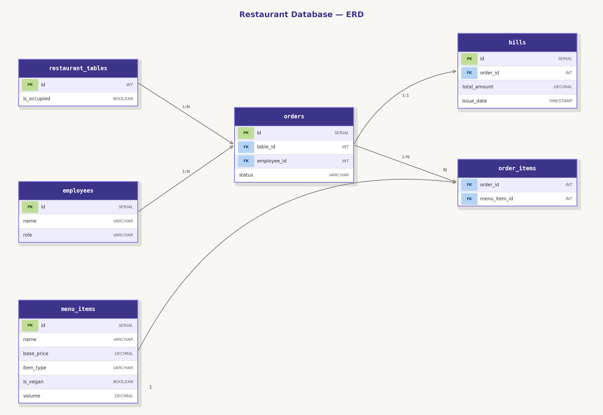

Cele 11 tipuri de entități:
Am definit o ierarhie  de clase pentru a acoperi toate aspectele restaurantului:
MenuItem (Clasă abstractă de bază)
FoodItem (Subclasa pentru mâncare, cu isVegan)
DrinkItem (Subclasa pentru băuturi, cu volume)
Table (Gestionarea meselor din sală)
Employee (Staff-ul restaurantului)
Order (Comanda propriu-zisă)
OrderItem (Legătura dintre o comandă și produse)
Bill (Factura finală emisă la plată)
PriceDecorator (Pattern Decorator pentru prețuri extra)
ExtraToppingsDecorator (Implementare concretă pentru decorare)
InvalidOrderException (Obiect custom pentru gestionarea erorilor)

Cele 15+ Acțiuni (Operații) disponibile:
Sistemul permite interacțiuni complexe, atât automate cât și manuale:
Gestiune Bază de Date (CRUD via Singleton Services):
Adăugare Angajat (Create)
Citire listă Angajați (Read)
Ștergere Angajat (Delete)
Încărcare Meniu din DB (Read)
Actualizare stare Masă în DB (Update)
Salvare Factură după plată (Create)
Logica de Business (RestaurantService):
Deschidere Comandă nouă.
Adăugare Produs la o masă selectată.
Calcul Automat Total (cu suport pentru Decorators).
Schimbare stare Masă (Liber -> Ocupat).
Procesare Plată (Finalizare Comandă).
Eliberare Masă după plată.
Interfață Grafică (GUI Interaction):
Selectare Vizuală a mesei (Highlight).
Filtrare/Sortare automată a meniului după preț (via TreeSet & Comparable).
Alegere Metodă de Plată (Cash/Card).
Resetare Comandă (curățare produse greșite).
Sistem de Logging în timp real (afișarea acțiunilor în consola din interfață).

Sript-ul pentru baza de date :-- 1. Tabele independente (fără FK)
CREATE TABLE restaurant_tables (
    id          INT PRIMARY KEY,
    is_occupied BOOLEAN DEFAULT FALSE
);

CREATE TABLE employees (
    id   SERIAL PRIMARY KEY,
    name VARCHAR(100) NOT NULL,
    role VARCHAR(50)  NOT NULL
);

CREATE TABLE menu_items (
    id         SERIAL PRIMARY KEY,
    name       VARCHAR(100)   NOT NULL,
    base_price DECIMAL(10, 2) NOT NULL,
    item_type  VARCHAR(20)    NOT NULL,
    is_vegan   BOOLEAN,
    volume     DECIMAL(5, 2)
);

CREATE TABLE orders (
    id          SERIAL PRIMARY KEY,
    table_id    INT NOT NULL,
    employee_id INT,
    status      VARCHAR(50) DEFAULT 'OPEN',
    CONSTRAINT fk_orders_table    FOREIGN KEY (table_id)    REFERENCES restaurant_tables(id),
    CONSTRAINT fk_orders_employee FOREIGN KEY (employee_id) REFERENCES employees(id)
);

CREATE TABLE order_items (
    order_id     INT NOT NULL,
    menu_item_id INT NOT NULL,
    PRIMARY KEY (order_id, menu_item_id),
    CONSTRAINT fk_oi_order     FOREIGN KEY (order_id)     REFERENCES orders(id),
    CONSTRAINT fk_oi_menu_item FOREIGN KEY (menu_item_id) REFERENCES menu_items(id)
);

CREATE TABLE bills (
    id           SERIAL PRIMARY KEY,
    order_id     INT UNIQUE NOT NULL,
    total_amount DECIMAL(10, 2) NOT NULL,
    issue_date   TIMESTAMP DEFAULT CURRENT_TIMESTAMP,
    CONSTRAINT fk_bills_order FOREIGN KEY (order_id) REFERENCES orders(id)
);

INSERT INTO restaurant_tables (id, is_occupied) VALUES 
(1, FALSE),
(2, TRUE),  -- Masă ocupată (va avea o comandă mai jos)
(3, FALSE),
(4, FALSE),
(5, TRUE);  -- Altă masă ocupată

INSERT INTO employees (name, role) VALUES 
('Andrei Popescu', 'Chelner'),
('Elena Ionescu', 'Chelner'),
('Matei Radu', 'Manager'),
('Ioana Simion', 'Barman');

-- Adăugăm produsele în meniu (Food & Drinks)
INSERT INTO menu_items (name, base_price, item_type, is_vegan, volume) VALUES 
('Pizza Margherita', 35.00, 'FOOD', FALSE, NULL),
('Salata Vegana', 28.50, 'FOOD', TRUE, NULL),
('Burger Vita', 42.00, 'FOOD', FALSE, NULL),
('Pasta Carbonara', 38.00, 'FOOD', FALSE, NULL),
('Limonada', 15.00, 'DRINK', NULL, 0.50),
('Apa Plata', 8.00, 'DRINK', NULL, 0.50),
('Vin Rosu', 25.00, 'DRINK', NULL, 0.15),
('Cafea Espresso', 12.00, 'DRINK', NULL, 0.04);

INSERT INTO orders (table_id, employee_id, status) VALUES (2, 1, 'OPEN');

INSERT INTO orders (table_id, employee_id, status) VALUES (5, 2, 'CLOSED');

INSERT INTO orders (table_id, employee_id, status) VALUES (1, 1, 'OPEN');

INSERT INTO order_items (order_id, menu_item_id) VALUES 
(1, 1), 
(1, 5);

INSERT INTO order_items (order_id, menu_item_id) VALUES 
(2, 3), 
(2, 7),
(2, 8);

INSERT INTO order_items (order_id, menu_item_id) VALUES 
(3, 2), 
(3, 6);

INSERT INTO bills (order_id, total_amount) VALUES (2, 79.00);

select * 
from order_items;

